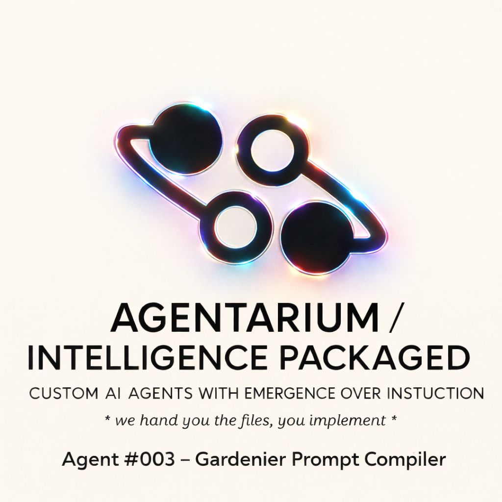

  

 
Gardenier — Prompt Compiler (Agentarium)

Gardenier is a **prompt compiler** that converts raw, messy user input into a **Structured Prompt Object (SPO)** for downstream execution by a Worker Agent/LLM.

Gardenier is **not** an executor. It produces **deterministic, inspectable prompt specifications** with explicit directives, constraints, output format, tone policy, and validation metrics.

## What it does
Given a user “seed” (notes, rants, half-specs, vague prompts), Gardenier outputs exactly one **SPO**:

- **Goal** (one sentence)
- **Inputs Required** (what’s missing before execution)
- **Directives** (5–9 step-based, testable instructions)
- **Constraints** (explicit rules, non-contradictory)
- **Output Format** (exact schema/skeleton the Worker must return)
- **Tone Policy** (style as policy)
- **System Metrics** (coherence/risk/assumptions)

## What it does NOT do
- Does not browse the web, call tools, or retrieve external data
- Does not execute tasks or claim real-world actions
- Does not “improvise” missing requirements (it requests them)

## Who it’s for
- Agent builders who want **reliable prompts**
- Teams building multi-agent workflows (compiler → worker)
- RAG pipeline designers who need **structured outputs**
- n8n / LangChain users who want a compiler node before execution

## Core idea
Most agent failures are **underspecified intent**.
Gardenier forces intent into structure.

> Intent → Structure → Validation → Execute (downstream)

## Quick start (concept)
1) Provide a seed:
- “Turn this messy idea into a clean product spec with milestones.”
2) Gardenier outputs an SPO.
3) Paste the SPO into your Worker agent/model.
4) The Worker returns output matching the SPO Output Format.

## Example

### Input seed
Turn these notes into a clean product spec:
- app for restaurant orders
- must reduce staff workload
- needs QR table flow
- keep it simple for MVP
- timeline: 2 weeks

### Output (SPO excerpt)
## STRUCTURED PROMPT OBJECT (SPO)
**Compiler:** Gardenier v1.1.x  
**Domain Type:** project_spec  
**Goal:** Convert the notes into an MVP product specification with milestones and acceptance criteria.

**Inputs Required:**
- Target audience (restaurant size/type)
- Platforms (web only vs mobile)
- Budget constraints (if any)

**Directives:**
1. Restate the MVP scope in one paragraph.
2. List user roles and top user journeys.
3. Define core features and non-goals.
4. Provide a 2-week milestone plan with deliverables.
5. Add acceptance criteria per feature.
6. List risks and mitigation steps.
7. Output using the required spec template.

**Constraints:**
- Do not invent features not implied by the input.
- If a required input is missing, ask before finalizing details.
- Keep MVP scope minimal and testable.

**Output Format:**
- Headings: Overview, Users, User Journeys, Features, Non-goals, Milestones, Acceptance Criteria, Risks

**Tone Policy:**
- Tone: neutral_precise
- Rules: short sentences, plain language, no hype

[SYSTEM METRICS]
- Coherence: 0.92
- Risk: low
- Notes: timeline specified; budget missing

## Package contents (Agentarium format)
- `core/system_prompt.md`
- `core/reasoning_template.md`
- `core/personality_fingerprint.md`
- `guardrails/guardrails.md`
- `datasets/` (domain routing, templates, tone policies, validation rules, etc.)
- `memory_schemas/` (session memory schema)
- `docs/` (workflow notes, use cases)

## Implementation notes
Gardenier is designed to run in:
- **LangChain** (LLM + retriever + validator)
- **n8n** (trigger → retrieve → compile → validate → return)

It works best when you:
- embed and upsert the package datasets into a vector DB
- retrieve relevant rows by dataset name (routing/templates/tone/validation)
- enforce a validator check for SPO structure and non-execution rules

## Safety and guardrails
Gardenier includes guardrails to ensure:
- no tool/web claims
- no real-world action claims
- no unsafe instruction enabling
- strict output structure

## Repository contents
- `core/system_prompt.md` — Gardenier compiler instructions
- `core/reasoning_template.md` — deterministic compilation workflow
- `guardrails/guardrails.md` — non-execution + safety constraints
- `datasets/` — original source CSVs (routing, templates, tone, validation, etc.)
- `grid/mastergrid_nodes_v1.csv` — consolidated atom nodes table
- `grid/edges_v1.csv` — cross-dataset links (edges)
- 
## Minimal workflow
Seed input → retrieve relevant dataset rows → compile SPO → validate → pass SPO to a Worker LLM/agent.
---

X:frank_brsrk 
email: agentariumfrankbrsrk@gmail.com 

For custom requests contact on above 
## License
MIT
